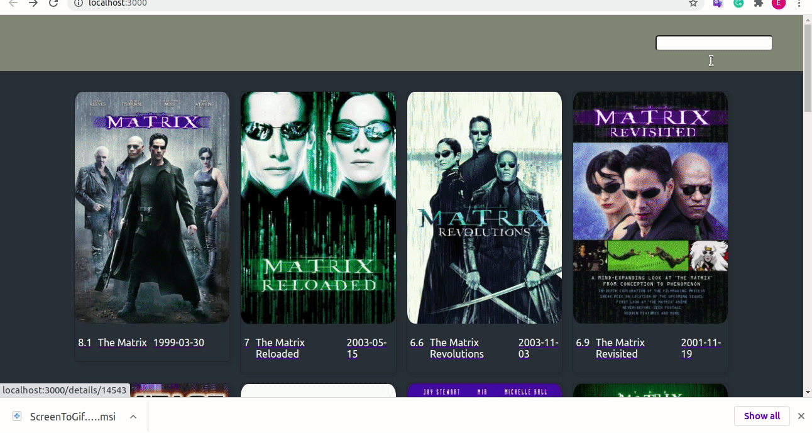

# IMDB
The application retrieves from https://api.themoviedb.org/3/search/movie Restfull api and searching films using the text input in the main page.

- axios
- node-sass
- styled-components
- react-router-dom

## Restful API
Film information was retrieved from [themoviedb](https://www.themoviedb.org/documentation/api)

## Overview



[Live Link from heroku](https://warm-basin-34700.herokuapp.com/)


## Installation and Dependencies

Please clone the repository like below:

```bash
git clone https://github.com/kopuskopecik/imdb.git

```

```bash
cd imdb/

yarn
```

## Usage

```bash
yarn start
```

Now everything is ready :+1:

## Contact

[Linkedin](https://www.linkedin.com/in/erdogan-sahin/)

[Github](https://github.com/kopuskopecik)

## License
[MIT](https://choosealicense.com/licenses/mit/)